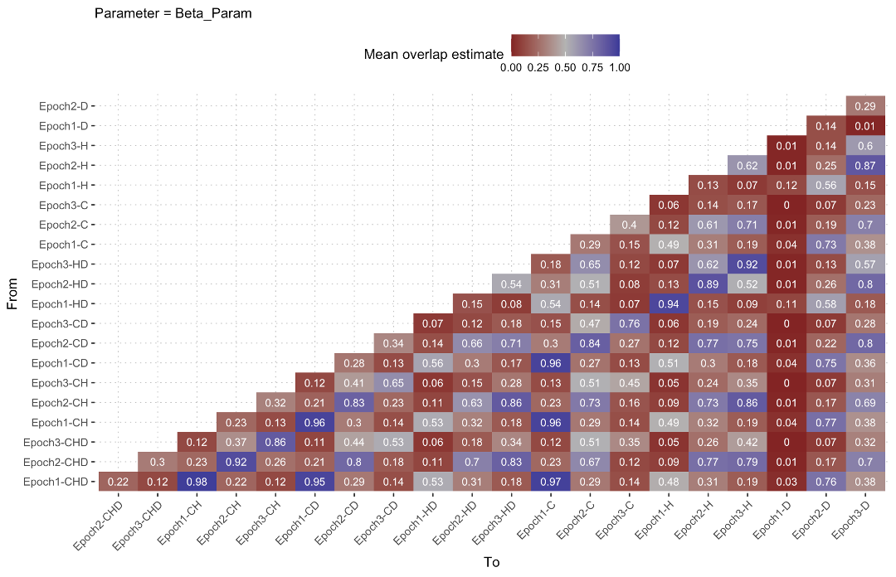

\newpage
# Introduction

In system dynamics, models must be grounded in data if modellers are to provide reliable advice to decision makers, and as part of this, robust parameter and confidence interval estimation is crucial [@struben2015parameter]. There are a number of computational methods that can be used to fit models and estimate parameters. These include: (1) the use of numerical optimisation combined with bootstrapping for confidence interval estimation and hypothesis testing in system dynamics models  [@https://doi.org/10.1002/sdr.362]; and (2) Markov chain Monte Carlo (MCMC) approaches to estimate the posterior distribution for parameters, a statistical approach that has gained significant adoption in the system dynamics community in recent years [@https://doi.org/10.1002/sdr.1501; @osgood2015combining; @https://doi.org/10.1002/sdr.1693; @ANDRADE2020100415; @doi:10.1098/rsos.230515; @https://doi.org/10.1002/sdr.1673; @10.1371/journal.pcbi.1010100].

Our approach in the paper is to fit an SEIR model (based on synthetic data) using Hamiltonian Monte Carlo (HMC) [@https://doi.org/10.1002/sdr.1693], in order to gain insights into the how the availability of data (through epochs and indicators) impacts the overall credible intervals ranges for model parameters. Our choice of the three indicators is motivated by the benefits of having more than one indicator to calibrate a model, for example, to help migitate against reporting biases that would be a factor in real-world implemntations [@PolicyEPI]. 

As part of our analysis we also introduce a new evaluation method for comparing posterior distributions, known as overlapping, and this provides useful insights into the sensitivity of parameter estimation to the availability of data. 

The structure of the paper is as follows:

- We introduce the SEIR model structure and overall experimental design, which involves 21 experiments;

- We present an open-source computational framework, mainly written in R, and also using the Stan HMC package;

- We present a detailed set of results, including: convergence tests, model fits, descriptive summaries of fits; 95% quantile analysis; and, overlapping analysis for all 21 experiments.

- The appendices include: (1) a sample stan file for inference of cases, hospitalisations, and deaths; (2) the main script file for running experiments; (3) the configuration file for the experiments; and (4) the code comparing the posterior distributions.


# Model Structure and Experimental Design

## Model Structure

The model used is an extension the well-known deterministic SEIR structure [@vynnycky2010introduction], and is shown in Figure \@ref(fig:mod-seir). People start out as being susceptible to a novel pathogen, and with the introduction of *patient zero* to the infectious (I) stock, the contagion loop is activated. People then move to an exposed (E) stock, where they do not contribute to the force of infection ($\lambda$), before entering an infectious state. Once in an infectious state people contribute to the force of infection ($\lambda$), before exiting via a first order exponential delay structure. A certain proportion of those infected have symptoms (clinical fraction), and a proportion of infectious are hospitalised, while the remainder recover. Hospitalisation is modelled as a third order delay structure, and 90% of those hospitalised recover, while 10% do not and move to the deaths stock (D). Three stocks (TC, TH, and TD) are used to record the cumulative numbers of cases, hospitalisations, and deaths.

```{r, mod-seir, fig.cap='An SEIR Influenza Model with Hospitalisations and Deaths',echo=FALSE,out.width="85%"}

```
Equations (1-6) for the main SEIR structure are shown below. The parameters $\sigma$ and $\gamma$ represent the inverse of the latent and infectious delays, $c$ is the clinical fraction, and $h$ is the hospitalisation fraction. The model assumes that only those who show symptoms can end up in the hospital stream. The force of infection $\lambda$ is calculated based on product of the effective contact rate ($\beta$) with the number of infectious ($I$), divided by the total population ($N$).


\begin{align*}
\dot{S}      & = - \lambda S & (1) \\
\dot{E}      & =  \lambda S - \sigma E & (2) \\
\dot{I}      & =   \sigma E - (1-ch)\gamma I - ch\gamma I& (3) \\
\dot{R}      & =   (1-ch)\gamma I& (4) \\
\lambda      & = \beta\frac{I}{N} & (5) \\
\beta        & = 1.0 & (6) \\
\end{align*}

The hospitalisation stream is modelled via equations 7-13. It involves a straightforward sequence of stocks that model people staying in hospital, with the average length of stay ($L$) set to 10 days. The hospitalisation rate is governed by the fraction $ch$ exiting the infectious stock, and therefore for this model, that will evaluate to $0.6 \times 0.1=0.06$. Upon exiting hospital, $(1-d$) move to the stock $R_{H}$, while the fraction $d$ move to the stock $D$.

\begin{align*}
\dot{H_{1}}  & =   ch\gamma I - \frac{H_{1}}{L_{1}}& (7) \\
\dot{H_{2}}  & =   \frac{H_{1}}{L_{1}} - \frac{H_{2}}{L_{2}} & (8) \\
\dot{H_{3}}  & =   \frac{H_{2}}{L_{2}} - d\frac{H_{3}}{L_{3}} - (1-d)\frac{H_{3}}{L_{3}}& (9) \\
\dot{R_{H}}  & =   (1-d)\frac{H_{3}}{L_{3}}& (10) \\
\dot{D}      & =   d\frac{H_{3}}{L_{3}}   & (11) \\
L_{1} = L_{2} = L_{3}     & = \frac{L}{3.0} & (12) \\
L            & = 10 & (13) \\
\end{align*}

As part of the inference process, we need to generate incidence rates for cases, hospitalisations, and deaths, and these numbers are initially recorded as cumulative (stock) values (14-16).

\begin{align*}
\dot{T_{C}}  & =  c\sigma E & (14) \\
\dot{T_{H}}  & =  ch\gamma I & (15) \\
\dot{T_{D}}  & =  d\frac{H_{3}}{L_{3}} &(16) \\
\end{align*}

The difference values are calculated as follows (17-19), and these values are then used as part of the data fitting process.

\begin{align*}
X_{C}(t+1)  & = T_{C}(t+1) - T_{C}(t)  &  (17)\\
X_{H}(t+1)  & = T_{H}(t+1) - T_{H}(t)   & (18)\\
X_{D}(t+1)  & = T_{D}(t+1) - T_{D}(t)   & (19)\\
\end{align*}

The statistical distributions (count data) used for the fitting process are shown in equations (20-22), and this is appropriate given that the synthetic data generated for the three indicators in based on the negative binomial distribution. Note that, depending on the experiment, a subset of these will be used.

\begin{align*}
Y_{C}  &  \sim Nbin(X_{C},\phi_{1})  &  (20) \\
Y_{H}  &  \sim Nbin(X_{H},\phi_{2})  &  (21) \\
Y_{D}  &  \sim Nbin(X_{D},\phi_{3})  &  (22) \\
\end{align*}

The model parameters for the experiments are shown below. Two of these are based on the literature relating to pandemic influenza [@vynnycky2008analyses], and the remaining values are arbitrary choices used as part of the experimentation process. Four of these parameters ($\beta$, $c$, $d$ and $h$) will be estimated as part of the MCMC inference process.

\begin{center}  
\begin{tabular}{ | l | c | c | l | l |} % you can change the dimension according to the spacing requirements  
\hline  
Name & Symbol & Value  & Units & Source \\ \hline  
Latent Duration & $\sigma^{-1}$ & 2.0 & $Days$ & Vynnycky et al. [12]\\ \hline  
Infectious Duration & $\gamma^{-1}$ & 2.0 & $Days$ & Vynnycky et al. [12]\\ \hline  
Effective Contact Rate & $\beta$ & 1.0 & $Days^{-1}$ & Model estimate\\ \hline  
Clinical Fraction (CF)& $c$ & 0.60 & $Dimn$ & Model estimate\\ \hline  
Death Fraction (DF) & $d$ & 0.10 & $Dimn$ & Model estimate\\ \hline 
Hospitalisation Fraction (HF) & $h$ & 0.10 & $Diml$ & Model estimate\\ \hline 
Average Length of Stay & $L$ & 10.0 & $Days$ & Model estimate\\ \hline 
\end{tabular}  
\end{center}  


## Experimental Design

The overall aim of the experimental design is to explore the possible effect of data availability and indicator coverage on the fitting process. The SEIR model was run once, and synthetic data generated, as shown in Figure \@ref(fig:sys-syn). This synthetic data was based on the SEIR model values generated (17-19), and different levels of variation were introduced via the negative binomial dispersion parameter, where values of 10, 20 and 40 were used respectively for cases, hospitalisations, and deaths.

```{r, sys-syn, fig.cap='Sample synthetic data generated for the experiments',echo=FALSE,out.width="85%"}
knitr::include_graphics("diagrams/sys_synthetic.png")
```

With three data sets available, a factorial-type set of experiments was designed based on:

* Three epochs of equal length, one for the start of the epidemic, one for the middle duration, and one for the end. These are shown on the figure, and capture different dynamic phases (e.g. exponential growth, inflection point, peak, and decline) for each indicator.

* Seven combinations of indicators based on the indicators cases (C), hospitalisation (H), and deaths (D). This yielded the subsets: (CHD,CH,CD,HD,C,H,D).

The combination of epochs (3) and indicators (7) were then combined to run 21 experiments, which involve fitting the parameters to different data sources. The computation framework for this process is now described.


# Computational Framework
Figure  \@ref(fig:sys-design) captures the overall computational framework used to configure the experiments, generate the results, and produce the analysis. In order to execute this workflow, which is open-source and designed using R [@duggan2016system; @ExploreR], a number of additional components were required:

* Stan [@carpenter2017stan], a statistical modelling platform, which provides an interface to perform Bayesian inference via the No-U-Turn-Sampler (NUTS). Stan models can contain ordinary differential equations, and is used to perform inference for deterministic models of infectious disease [@https://doi.org/10.1002/sdr.1693; @ANDRADE2020100415; @doi:10.1098/rsos.230515]

* `cmdstanr` [@gabry2021cmdstanr], which is a lightweight interface to Stan for R users.

* `readsdr` [@andrade_readsdr], a package that automatically converts XMILE files from Stella and Vensim to Stan code.

* R's tidyverse packages, specifically `dplyr` for data manipulation, `ggplot2` for visualisation and `tidyr` for nesting data frames, a feature that allows the results to be conveniently organised into a 21 by 12 table.

```{r, sys-design, fig.cap='Overall framework for experiments',echo=FALSE,out.width="85%"}
knitr::include_graphics("diagrams/sys_design.png")
```

The overall framework is divided into three main functions.

* **Generate Synthetic Data**, which runs the SEIR model using the package `readsdr` for one instance, and is based on the differencing of the three indicator stocks (see equations 13-15). The negative binomial distribution is used to generate random count variables based on the model outputs. For this experiment, the dispersion parameters selected are (10, 20, 40) for (Cases, Hospitalisations, and Deaths). A sample run from the synthetic data generation process is shown in Figure \@ref(fig:sys-syn).  


* **Estimate Parameters**, which performs the fitting process. For each experiment, this will (1) use `readsdr` to generate a stan file, (2) run the stan file using the `cmdstanr` interface, and (3) prepare and store all of the results in a single multidimensional data structure. This structure will contain one row for each experiment, and encapsulate variables such as the number of indictors, the measurement model, the data used for the calibration, the posterior samples for each parameter (4,000 each), the time series output for each model run, and the duration of the run. Given the computational resources needed to run the fitting, an advantage of storing all the results in a database (RDS file used) is that the analysis stage can then be conducted independently.

* **Analyse Results**, which provides a number of scripts to generate a range of results to support analysis. These include: trace plots to explore convergence; time series showing the fits; boxplots highlighting the parameter distributions across all 21 experiments; quantile analysis to show the 95% credible intervals from the inference process; and overlap analysis to provide insights into how close the posterior distributions are for each combination of epoch and indicator.

The results are now presented in more detail.

# Results
Overall, the inference process for the 21 experiments generates over 273MB of data, so there is a wide range of analysis that can be performed. Given that the overall goal is to explore possible differences in parameter estimates, our analysis comprises the following stages:

* Presentation of convergence tests for each parameter over the four MCMC chains, for each of the 21 data configurations.

* Exploring of the model fits, to confirm that the parameter estimates generate plausible dynamic behaviour for each model.

* Boxplots to highlight the distribution of inferred parameters, and to see how the estimates line up with the original values used to construct the synthetic data sets.

* Overlapping analysis, defined as the area intersected by two or more probability density functions [@Pastore2018; @10.3389/fpsyg.2019.01089], to provide a measure of how close the estimates are across each of the 21 experiments.


## Convergence Tests

Our first analysis, capture in Figure  \@ref(fig:exp-conv), displays the trace plots showing how the estimates of the parameter values change over the MCMC process. Four MCMC chains are run, with 1000 iterations for the warm-up phase, and 1000 for the sampling process. The goal is to ensure that a stationary distribution is achieved for all parameters [@https://doi.org/10.1002/sdr.1693], and this is achieved, and confirmed by analysing the output from stan, which showed no divergences within all the samples. This chain convergence is an important property of the inference method. However, the plots can also illustrate interesting properties of the fitted parameters. Through observation, we can see the different ranges of the estimates, for example:

* Experiments involving epoch one (the opening phase of the epidemic) typically have wider ranges, which is as expected, as there is less data available to inform the fitting process. For example, for the parameter `HF` (true value $0.1$), the values for `Epoch1-C` seem to cover the interval from 0 to 1.

* Experiments where the three indicators were used tend to have narrower bands, which again is intuitive given that more information is available for the calibration process. Returning to parameter `HF`, we can see that its values for `Epoch1-CHD` remain much closer to the true value of $0.1$.

A more detailed analysis of these parameter values will be explored through boxplots, quantile analysis and overlapping analysis.

```{r, exp-conv, fig.cap='Exploring parameter convergence',echo=FALSE,out.width="85%"}
knitr::include_graphics("diagrams/exp_convergence.png")
```


## Model fits

An important requirement for calibration is that the model provides a plausible representation of historical data, and in MCMC fitting we can also explore the time series quantiles returned as part of the posterior distribution. From a process perspective, having fits that align with historical data is needed to confirm that the model structure can generate the behaviour of interest, and these outputs also can be deployed as a confidence-building measure for modellers and clients. A sample of the fits are displayed in Figure  \@ref(fig:exp-fits), for the indicators *Cases* and *Deaths*, across three of the epochs. The mean value from the MCMC samples is also shown, and overall, on visual inspection, these look like good fits to the data.


```{r, exp-fits, fig.cap='A sample of fits from the inference process',echo=FALSE,out.width="85%"}
knitr::include_graphics("diagrams/exp_fits.png")
```


An interesting aspect is what the fits do not show, which is the range of parameter values underling the generated time series. For example, if you take the set of plots in row 1 column 1 (epoch 1), and compare the fits for indicator *C* and indicators *CHD*, there is not an observable distinction between both, in that both fits look plausible. However, when we compare the parameters estimated for these two samples, differences emerge. This can first be explored using boxplots.


## Boxplots of parameter estimates

The boxplot is a valuable method to summarise data, as it shows the median, the interquartile range (IQR), the location of values 1.5 times above and below the 75th and 25th percentiles, and outliers. We use the boxplot as a means to compare parameter values from all 21 experiments, and estimated across (1) each of the three epochs and (2) all of the seven combinations of data indicators. The 84 boxplots are presented in Figure \@ref(fig:exp-boxplots). Our working assumption is that a narrower range indicates a more certain fit (the 95% credible intervals are shown in the following section).


```{r, exp-boxplots, fig.cap='Box plot analysis for parameters by epoch and indicator source(s)',echo=FALSE,out.width="85%"}

```

We can initailly observe a number of patterns from these descriptive statistics:

* Across all parameters, the narrowest parameter estimate ranges seem to be those fits using the most indicators, and using the most data (i.e. epoch 3).

* The rate at which parameters "lose their narrowness" varies across both indicators, and epochs. For example, the parameter $\beta$ within epoch 3 retains a narrow range for most indicator combinations, while the death fraction (DF) only retains a narrow range using three indicators across epoch 1 and 2.

* Therefore, this highlights a difference depending on the epochs used, and the indicators. For example, for parameter `DF` with indicators `CHD`, there is a large difference in median and the overall spread of data across the three epochs. 


## Quantile analyis of fitted parameters
The plots displayed in the preceding section are useful to gain an overall appreciation of the posterior distributions, and to supplement that analysis, it is important to show the 95% credible intervals. For the four parameters, this information is presented in Figure \@ref(fig:exp-quants), and arranged in descending order by the difference between the upper and lower quantiles.

```{r, exp-quants, fig.cap='Summary of quantiles for parameters across the 21 experiments.',echo=FALSE,out.width="90%"}

```
For each of the fitted parameters, we can make the following initial observations:

* *Beta_Param*, which models the effective contact rate within the population model. The true value is 1.0, and many of the 95% ranges contain this value. A shift in the range occurs for observation 14, and the experiment `Epoch1-CH`. From that point onwards, 7 of the 8 experiments relate to epoch 1, showing that epoch1 is prominent for fits with wider estimate ranges.

* *Clinical fraction (CF)*, which is the fraction of cases that are clinical, with a true value of 0.60. All of the estimates include this value, although a significant shift in the range happens with experiment 9 (`Epoch1-CHD`). Prior to that, of the eight experiments that have narrower bands, four are from epoch 2 and four from epoch 3. The four best are from epoch 3, which has the most data points used for the calibration process.

* *Hospitalisation fraction (HF)*, which is the fraction of cases hospitalised, with a true value of 0.10. All values contain the true value within their range, however, an observable widening of the range occurs from expertment 5 (`Epoch1-CHD`). Of the four experiments with the narrowest interval, two are from epoch 3, and two from epoch 2.

* *Death fraction (DF)*, which is the fraction of hospitalisations that die, with a true value of 0.10. Interestingly, the narrowest ranges (the first four experiments) do not cover the true value at the 2.5% level, although the difference is small (e.g. 0.002 for `Epoch2-CHD`).   

## Overlapping analysis of posterior densities

Visual inspection of the parameter densities can be performed for each of the 21 experiments. The aim is to identify fitted parameters that have different posterior distributions, and explore possible reasons why this might be so. In Figure \@ref(fig:exp-density-1) we explore the posterior densities for $\beta$ and $c$ (the clinical fraction). The original model parameter values are indicated by the dotted vertical lines, and the density plots are divided into three epochs. The purpose of these plots is to show the overall shape, however it should be noted that the scales on the x axis are different. For example, that parameter range for *Beta_Param* in epoch 3 is quite small, when compared to epochs 1 and 2. There seems to be more variation for the clinical fraction parameter with an epoch, and across the three epochs.

```{r, exp-density-1, fig.cap='Posterior density distributions for beta and the clinical fraction',echo=FALSE,out.width="85%"}

```


```{r, exp-density-2, fig.cap='Posterior density distributions for hospitalisation and death fractions',echo=FALSE,out.width="85%"}
knitr::include_graphics("diagrams/exp_density_hf_df.png")
```


While the visual inspection method is a useful way to explore differences, more formal approaches can provide measurements to provide insights into the similarity between distributions. One such method is *overlapping*, which defined as the area intersected by two or more probability density functions [@10.3389/fpsyg.2019.01089]. The R package `overlapping` [@Pastore2018] is used to calculate this measure for each fitted parameter, with comparisons made between each of the 21 experiments. Output from an overlapping analysis of the parameter $\beta$ is shown in Figure \@ref(fig:exp-overlap-beta).


```{r, exp-overlap-beta, fig.cap='Overlapping analysis for beta',echo=FALSE,out.width="85%"}

```

While we already mentioned that the range for epoch 3 is quite narrow for $\beta$ estimates, the data provided through this analysis is interesting. For example, the highest overlapping value (98%) is between `Epoch1-CHD` and `Epoch1-CH`, where the only difference between these data sets is the used of the deaths indicator. In general, overlapping values of 90% or higher are associated with data sets from similar epochs, which is a useful test of the fitting process.The lowest overlapping values are associated with `Epoch1-D`, which would have the lowest amount of data (one indicator with 33 data points).


A second overlapping analysis for the hospitalisation fraction parameter is shown in Figure \@ref(fig:exp-overlap-hf), and these show a range of values from a high overlapping fraction of 99% (`Epoch2-C` with `Epoch3-C`), and low values of 2%, for example, between `Epoch3-CH` and `Epoch1-C`. If we take `Epoch3-CHD` as a plausible experiment where you would expect good estimations (given that it maximises the amount of data for calibration), it is interesting to see that only one other experiment has a high level of overlap, namely, `Epoch3-CH`.


```{r, exp-overlap-hf, fig.cap='Overlapping analysis for hospitalisation fraction',echo=FALSE,out.width="85%"}

```

Overall, the value of this overlapping algorithm is that it provides a similarity measurement between the parameter posterior distributions. The measure indicates the impact of data availability, and choice of indicators, on the fitting process. Potentially, this approach could have value during the validation stages of parameter fitting, as a means to explore teh relationships between data availability and parameter estimates.

On reflection, it would also have been useful to highlight the prior distribution on the density graphs, just to confirm that the fitting process has been impacted by the available data. For example, some of the posterior densities for the death fraction (Epoch1), do look quite similar to the prior $Beta(2,2)$ distribution that was specified as part of the stan inference model.

Further research could combine additional fitting metrics to bear on this process. For example, the potential scale-reduction factor ($\widehat{R}$) [@https://doi.org/10.1002/sdr.1693] which compares within-chain variance (stationarity) to between-chain variance (mixing). This could provide further insights into how the overlap percentage could be used to indicate an acceptable level of similarity between posterior distributions. Also, the use of additional unsupervised machine learning methods such as clustering could be benefiical, as a way to explore further patterns in the data.

# Conclusion
In reflecting on the results, a valuable output (in additional to the visualisation and exploratory analysis), is the calculation of the overlapping metric, whic presents a similarity measure between the parameter estimates. The differences calculated indicate that the MCMC fitting process is sensitive to (1) the amount of data in a time series (e.g. whether it is epoch one, two, or three), and (2)  the number of indicators available for the process (combinations of cases, hospitalisations, and deaths). On the broader point, it also suggests that modellers must reflect on parameter estimates, and how the ranges can vary depending on the amount of data available. Overall, despite impressive technical advances in computational inference processes, parameter estimation remains a challenging task in system dynamics; the following quote seems as relevant today as it was in the early 2000s.

> ... limitations in numerical data availability mean it is often impossible to estimate all parameters in a model. 
> You must also develop the ability to estimate parameters judgmentally using expert opinion gleaned from
> interviews, workshops, archival materials, direct experience, and other methods.
>
> --- John D. Sterman [@StermanBook]


\newpage
# Appendix 1 - Stan model for CHD Indicators
The following stan code was automatically generated by the package `readsdr` [@andrade_readsdr] based on the Stella XMILE file. It embeds the system dynamics model (functions block), and also adds code to calculate the incidence data (`delta_x_1`, `delta_x_2`, and `delta_x_3`), namely the earlier equations (17-19). The `model` block below comprises the parameters to be fitted, and also specifies the distributions for cases (C), hospitalisations (H), and deaths (D). A separate stan file (seven in total) was created for each unique combination of indicator (i.e., CHD, CH, CD, HD, C, H, and D). 

```{r,echo=TRUE,eval=FALSE}
// Code generated by the R package readsdr v0.2.0.9014
// See more info at github https://github.com/jandraor/readsdr

// SEIR Model in stan, direct translation from XMILE via readsdr
functions {
  vector X_model(real time, vector y, array[] real params) {
    vector[12] dydt;
    real ER;
    real RR;
    real HR1;
    real HR2;
    real HR3;
    real RRH;
    real RRD;
    real Lambda;
    real TCI;
    real THI;
    real TDI;
    real TIH;
    real Checksum;
    real IR;
    ER = y[2]*0.5;
    RR = (1-params[1]*params[2])*y[3]*0.5;
    HR1 = params[1]*params[2]*y[3]*0.5;
    HR2 = y[5]/(10/3.0);
    HR3 = y[6]/(10/3.0);
    RRH = (1-params[3])*y[7]/(10/3);
    RRD = params[3]*y[7]/(10/3.0);
    Lambda = params[4]*y[3]/1e+05;
    TCI = params[1]*ER;
    THI = HR1;
    TDI = RRD;
    TIH = y[5]+y[6]+y[7];
    Checksum = y[1]+y[2]+y[3]+TIH+y[4]+y[8]+y[9];
    IR = y[1]*Lambda;
    dydt[1] = -IR;
    dydt[2] = IR-ER;
    dydt[3] = ER-RR-HR1;
    dydt[4] = RR;
    dydt[5] = HR1-HR2;
    dydt[6] = HR2-HR3;
    dydt[7] = HR3-RRH-RRD;
    dydt[8] = RRH;
    dydt[9] = RRD;
    dydt[10] = TCI;
    dydt[11] = THI;
    dydt[12] = TDI;
    return dydt;
  }
}

// Data for the calibration process
data {
  int<lower = 1> n_obs;
  array[n_obs] int C;
  array[n_obs] int H;
  array[n_obs] int D;
  array[n_obs] real ts;
  vector[12] x0;
}


// Parameters to be fitted.
parameters {
  real<lower = 0, upper = 1> CF;
  real<lower = 0, upper = 1> HF;
  real<lower = 0, upper = 1> DF;
  real<lower = 0> Beta_Param;
  real<lower = 0> inv_phi1;
  real<lower = 0> inv_phi2;
  real<lower = 0> inv_phi3;
}

// Calling the SEIR model and extracting cases
transformed parameters{
  array[n_obs] vector[12] x; // Output from the ODE solver
  array[4] real params;
  array[n_obs] real delta_x_1;
  array[n_obs] real delta_x_2;
  array[n_obs] real delta_x_3;
  real phi1;
  real phi2;
  real phi3;
  phi1 = 1 / inv_phi1;
  phi2 = 1 / inv_phi2;
  phi3 = 1 / inv_phi3;
  params[1] = CF;
  params[2] = HF;
  params[3] = DF;
  params[4] = Beta_Param;
  x = ode_rk45(X_model, x0, 0, ts, params);
  delta_x_1[1] =  x[1, 10] - x0[10] + 1e-5;
  delta_x_2[1] =  x[1, 11] - x0[11] + 1e-5;
  delta_x_3[1] =  x[1, 12] - x0[12] + 1e-5;
  for (i in 1:n_obs-1) {
    delta_x_1[i + 1] = x[i + 1, 10] - x[i, 10] + 1e-5;
    delta_x_2[i + 1] = x[i + 1, 11] - x[i, 11] + 1e-5;
    delta_x_3[i + 1] = x[i + 1, 12] - x[i, 12] + 1e-5;
  }
}

// The stan model, including priors.
model {
  CF ~ beta(2, 2);
  HF ~ beta(2, 2);
  DF ~ beta(2, 2);
  Beta_Param ~ lognormal(0, 1);
  inv_phi1 ~ exponential(5);
  inv_phi2 ~ exponential(5);
  inv_phi3 ~ exponential(5);
  C ~ neg_binomial_2(delta_x_1, phi1);
  H ~ neg_binomial_2(delta_x_2, phi2);
  D ~ neg_binomial_2(delta_x_3, phi3);
}

// Values generated by fitting process.
generated quantities {
  real log_lik;
  array[n_obs] int sim_C;
  array[n_obs] int sim_H;
  array[n_obs] int sim_D;
  
  // The negative binomial probability mass given location and precision.
  log_lik = neg_binomial_2_lpmf(C | delta_x_1, phi1)+
            neg_binomial_2_lpmf(H | delta_x_2, phi2)+
            neg_binomial_2_lpmf(D | delta_x_3, phi3);
  
  // Generate the three negative binomial variates
  sim_C = neg_binomial_2_rng(delta_x_1, phi1);
  sim_H = neg_binomial_2_rng(delta_x_2, phi2);
  sim_D = neg_binomial_2_rng(delta_x_3, phi3);
}
```

# Appendix 2 - Overall script to run the inference process
This code is the main script used to run the inference process. Using R's `tidyverse` tools [@ExploreR], it stores all the runs in an RDS file which can be used for subsequent analysis.

```{r,echo=TRUE,eval=FALSE}

library(purrr)
library(glue)
library(lubridate)

source("R/02 estimate/Header.R")
get_stamp <- function(sep=" ")
{
  lubridate::ymd_hms(Sys.time()) %>%
    str_replace("UTC","") %>%
    str_trim() %>%
    str_replace(" ",sep)
}

# Get the data
epi <- get_data(config$G_DATA)

# Configure factorial design
exp <- configure_exp(config$EPOCHS,
                     config$MEAS_MODELS)

# Prepare readsdr stan measure models
exp <- exp %>%
        mutate(FitData=map(Epoch,~filter_data(epi,.x)),
               MM_readsdr=map(Indicators,~get_meas_model(.x)))

config$RUN_INFO <- vector(mode="list",length = nrow(exp))


# Run stan fits for each experiment, store in new column
exp <- exp %>%
        mutate(StanFit=pmap(list(ExpNumber,
                                 IndCode,
                                 Indicators,
                                 FitData,
                                 MM_readsdr),~{
          t1 <- Sys.time()
          start_time <- get_stamp()
          f <- fit_model(XMILE_FILE = config$G_MODEL,
                        STAN_FILE  = str_replace(config$G_STAN_MODEL,
                                                 "SEIRH.stan",
                                                 paste0("SEIRH_",..2,".stan")),
                        Exper      = ..1,
                        Indicators = ..3,
                        data       = ..4,
                        meas_model = ..5)
          diagnostic      <- f$cmdstan_diagnose()
          diagnostic_summ <- f$diagnostic_summary()
          finish_time <- get_stamp()
          config$RUN_INFO[[..1]] <<- list(ExpNo=..1,
                                          Indicators=..2,
                                          Obs=nrow(..3),
                                          Start_Time=start_time,
                                          Finish_Time=finish_time,
                                          Duration=Sys.time()-t1,
                                          Diagnostic=diagnostic,
                                          Diagnostic_Summary=diagnostic_summ)
          f
        }))


# Save in RDS file
STAMP <- get_stamp("#")

fits <- prepare_data1(exp,config)

rds_file  <- glue("data/estimates/{config$DESC}_{STAMP}_EP{length(config$EPOCHS)}_MM{length(config$MEAS_MODELS)}_FITS.rds")


saveRDS(fits,rds_file)
```


# Appendix 3 - Header.R file
Thsi script configures the runs and specifies (1) the source scripts for the SEIR model and data, (2) the epochs and (3) the indicator combinations.

```{r,echo=TRUE,eval=FALSE}
source("R/02 estimate/GenerateSamples.R")
source("R/02 estimate/Data.R")
source("R/02 estimate/PrepareData.R")

G_DESC <- "TEST"


config <- list(G_DATA        = "data/SEIRH_Beta.xlsx",
               G_MODEL       = "models/SEIRH_Beta.stmx",
               G_STAN_MODEL  = "models/stan/SEIRH.stan",
               EPOCHS        = c("Epoch1","Epoch2","Epoch3"),
               MEAS_MODELS   = list(c("Cases","Hospitalisations","Deaths"),
                                    c("Cases","Hospitalisations"),
                                    c("Cases","Deaths"),
                                    c("Hospitalisations","Deaths"),
                                    c("Cases"),
                                    c("Hospitalisations"),
                                    c("Deaths")),
               DESC          = G_DESC)
```


# Appendix 4 - Running the overlapping analysis
Here, we present one of the analysis scripts, which uses the `overlapping` package in R to generate a similarity measure between the posterior distributions.


```{r,echo=TRUE,eval=FALSE}
library(overlapping)
library(purrr)
library(dplyr)
library(tidyr)
library(ggpubr)

FILE   <- "data/estimates/TEST_2024-02-28#14:28:32_EP3_MM7_FITS.rds"
fits <- readRDS(FILE)

object_size(fits)

all_params <- fits %>%
               select(EpIndCode,Params) %>%
               unnest(cols = "Params")

# Prepare the data for pair-wise analysis for each parameter

prep <- map_df(list("CF","HF","DF","Beta_Param"),~{
  x1 <- all_params %>%
          select(EpIndCode,SN,dplyr::matches(.x))

  cf <- pivot_wider(x1,names_from=EpIndCode,
                       values_from = .x) %>%
        mutate(Param=.x) %>%
        select(Param,everything())
  cf
}) %>% group_by(Param) %>% nest()

overlaps <- prep %>%
              mutate(Overlap=map(data,~{
                d <- select(.x,-SN)
                exps <- names(d)
                cbs <- combn(exps,2)
                inputs <- list(From=cbs[1,],
                               To=cbs[2,])

                over <- map2_df(inputs$From,inputs$To,~{
                  v1 <- d[,.x] %>% pull()
                  v2 <- d[,.y] %>% pull()
                  ol <- overlap(list(v1,v2))$OV
                  tibble(From=.x,To=.y,Overlap=ol)
                })
                
                over
              })) 

oa <- overlaps %>% 
       select(Param,Overlap) %>% 
       unnest(cols="Overlap") %>%
       mutate(From=factor(From,levels=fits$EpIndCode),
              To=factor(To,levels=fits$EpIndCode))


s_oa <- oa %>%
          group_by(From,To) %>%
          summarise(Median=median(Overlap),
                    Mean=round(mean(Overlap),2),
                    Min=min(Overlap),
                    Max=max(Overlap))

p <- ggplot(s_oa,aes(x=To,y=From,fill=Mean))+geom_tile()+
  scale_fill_gradient2(midpoint = 0.5,mid="grey70",limits=c(0,1))+
  geom_text(aes(To, From, label=Mean), colour = "white", check_overlap = TRUE)+
  theme(legend.position = "top",
        axis.text.x = element_text(angle = 45,hjust = 1),
        panel.background = element_rect(fill="white"),
        panel.grid=element_line(colour="blue",linetype=3,linewidth = 0.3))+
  labs(fill="Mean overlap estimate")


sp_oa <- oa %>%
  group_by(From,To,Param) %>%
  summarise(Median=median(Overlap),
            Mean=round(mean(Overlap),2),
            Min=min(Overlap),
            Max=max(Overlap))

target <- "HF"
p <- ggplot(filter(sp_oa,Param==target),aes(x=To,y=From,fill=Mean))+geom_tile()+
  scale_fill_gradient2(midpoint = 0.5,mid="grey70",limits=c(0,1))+
  geom_text(aes(To, From, label=Mean), size=3,colour = "white", check_overlap = TRUE)+
  theme(legend.position = "top",
        axis.text.x = element_text(angle = 45,hjust = 1),
        panel.background = element_rect(fill="white"),
        panel.grid=element_line(colour="grey",linetype=3,linewidth = 0.3))+
  labs(fill="Mean overlap estimate",
       subtitle=paste0("Parameter = ",target))


# Plot histograms to show the overlaps
plots <- prep %>%
          mutate(Plots=map2(Param,data,~{
            set.seed(100)
            d <- select(.y,-SN)
            rn <- sample(1:ncol(d),4)
            d <- d %>% select(rn)
            plots <- final.plot(as.list(d),pairs=T)+labs(subtitle=.x)
          }))

p1 <- ggarrange(plotlist = plots$Plots)

```


