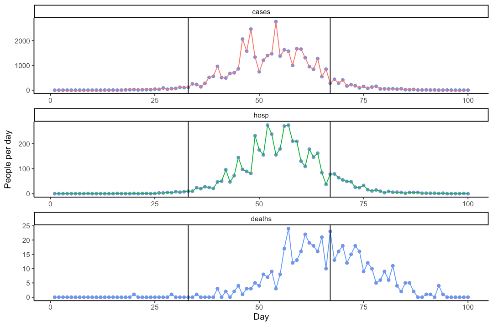

\newpage
# Introduction


Contributions

Three indicator model SEIR simple model

Overall pipeline for efficiently processing inference results

Use of a new method (overlapping analysis) to measure differences in parameter estimates
 

# Model Structure and Experimental Design

The model used is an extension the well-known deterministic SEIR structure [@vynnycky2010introduction], and is shown in Figure \@ref(fig:mod-seir). People start out as being susceptible to a novel pathogen, and with the introduction of *patient zero* to the infectious (I) stock, the contagion loop is activated. People then move to an exposed (E) stock, where they do not contribute to the force of infection ($\lambda$), before entering an infectious state. Once in an infectious state people contribute to the force of infection ($\lambda$), before exiting via a first order exponential delay structure. A certain proportion of those infected have symptoms (clinical fraction), and a proportion of infectious are hospitalised, while the remainder recover. Hospitalisation is modelled as a third order delay structure, and 90% of those hospitalised recover, while 10% do not and move to the deaths stock (D). Three stocks (TC, TH, and TD) are used to record the cumulative numbers of cases, hospitalisations, and deaths.

```{r, mod-seir, fig.cap='An SEIR Influenza Model with Hospitalisations and Deaths',echo=FALSE,out.width="100%"}
knitr::include_graphics("diagrams/SEIR.png")
```
Equations (1-4) for the main SEIR structure are shown below. The parameters $\sigma$ and $\gamma$ represent the inverse of the latent and infectious delays, $c$ is the clinical fraction, and $h$ is the hospitalisation fraction. The model assumes that only those who show symptoms can end up in the hospital stream. The force of infection $\lambda$ is calculated based on product of the effective contact rate ($\beta$) with the number of infectious ($I$), divided by the total population ($N$).


\begin{align*}
\dot{S}      & = - \lambda S & (1) \\
\dot{E}      & =  \lambda S - \sigma E & (2) \\
\dot{I}      & =   \sigma E - (1-ch)\gamma I - ch\gamma I& (3) \\
\dot{R}      & =   (1-ch)\gamma I& (4) \\
\lambda      & = \beta\frac{I}{N} & (5) \\
\beta        & = 1.0 & (6) \\
\end{align*}

The hospitalisation stream is modelled via equations 7-13. It involves a straightforward sequence of stocks that model people staying in hospital, with the average length of stay ($L$) set to 10 days. The hospitalisation rate is governed by the fraction $ch$ exiting the infectious stock, and therefore for this model, that will evaluate to $0.6 \times 0.1=0.06$. Upon exiting hospital, $(1-d$) move to the stock $R_{H}$, while the fraction $d$ move to the stock $D$.

\begin{align*}
\dot{H_{1}}  & =   ch\gamma I - \frac{H_{1}}{L_{1}}& (7) \\
\dot{H_{2}}  & =   \frac{H_{1}}{L_{1}} - \frac{H_{2}}{L_{2}} & (8) \\
\dot{H_{3}}  & =   \frac{H_{2}}{L_{2}} - d\frac{H_{3}}{L_{3}} - (1-d)\frac{H_{3}}{L_{3}}& (9) \\
\dot{R_{H}}  & =   (1-d)\frac{H_{3}}{L_{3}}& (10) \\
\dot{D}      & =   d\frac{H_{3}}{L_{3}}   & (11) \\
L_{1} = L_{2} = L_{3}     & = \frac{L}{3.0} & (12) \\
L            & = 10 & (13) \\
\end{align*}

As part of the inference process, we need to generate rates for cases (14), hospitalisations (15), and deaths (16), and these numbers are recorded as cumulative (stock) values. The Stan file generated (via the package `readsdr`) will difference these values in order to compare the simulated model values with the (synthetic) data values as part of the likelihood calculations for the posterior distributions.

\begin{align*}
\dot{T_{C}}  & =  c\sigma E & (14) \\
\dot{T_{H}}  & =  ch\gamma I & (15) \\
\dot{T_{D}}  & =  d\frac{H_{3}}{L_{3}} &(16) \\
\end{align*}


Finally, we present the relevant model parameters for the experiments. Two of these are based on the literature relating to pandemic influenza [@vynnycky2008analyses], and the remaining values are arbitrary choices used as part of the experimentation process. For example, four of these parameters ($\beta$, $c$, $d$ and $h$) will be estimated as part of the inference process.


\begin{center}  
\begin{tabular}{ | l | c | c | l | l |} % you can change the dimension according to the spacing requirements  
\hline  
Name & Symbol & Value  & Units & Source \\ \hline  
Latent Duration & $\sigma^{-1}$ & 2.0 & $Days$ & Vynnycky et al. [3]\\ \hline  
Infectious Duration & $\gamma^{-1}$ & 2.0 & $Days$ & Vynnycky et al. [3]\\ \hline  
Effective Contact Rate & $\beta$ & 1.0 & $Days^{-1}$ & Model estimate\\ \hline  
Clinical Fraction (CF)& $c$ & 0.60 & $Dimn$ & Model estimate\\ \hline  
Death Fraction (DF) & $d$ & 0.10 & $Dimn$ & Model estimate\\ \hline 
Hospitalisation Fraction (HF) & $h$ & 0.10 & $Diml$ & Model estimate\\ \hline 
Average Length of Stay & $L$ & 10.0 & $Days$ & Model estimate\\ \hline 
\end{tabular}  
\end{center}  


# Computational Framework
Figure  \@ref(fig:sys-design) captures the overall computational framework used to configure the experiments, generate the results, and produce the analysis. In order to execute this workflow, which is open-source and designed using R [@duggan2016system], a number of additional components were required:

* Stan [@carpenter2017stan], a statistical modelling platform, which provides an interface to perform Bayesian inference via the No-U-Turn-Sampler (NUTS). Stan models can contain ordinary differential equations, and is used to perform inference for deterministic models of infectious disease [@https://doi.org/10.1002/sdr.1693; @ANDRADE2020100415; @doi:10.1098/rsos.230515]

* `cmdstanr` [@gabry2021cmdstanr], which is a lightweight interface to Stan for R users.

* `readsdr` [@andrade_readsdr], a package that automatically converts XMILE files from Stella and Vensim to Stan code.

* R's tidyverse packages, specifically `dplyr` for data manipulation, `ggplot2` for visualisation and `tidyr` for nesting data frames, a feature that allows the results to be conveniently organised into a 21 by 12 table.

```{r, sys-design, fig.cap='Overall data analytics framework for experiments',echo=FALSE,out.width="100%"}
knitr::include_graphics("diagrams/sys_design.png")
```

The overall framework is divided into three main functions.

* **Generate Synthetic Data**, which runs the SEIR model using the package `readsdr` for one instance, and is based on the differencing of the three indicator stocks (see equations 13-15). The negative binomial distribution is used to generate random count variables based on the model outputs. For this experiment, the dispersion parameters selected are (10, 20, 40) for (Cases, Hospitalisations, and Deaths). Sample output from this process is shown in  Figure \@ref(fig:sys-syn). 


* **Estimate Parameters**, which performs the fitting process. For each experiment, this will (1) use `readsdr` to generate a stan file, (2) run the stan file using the `cmdstanr` interface, and (3) prepare and store all of the results in a single multidimensional data structure. This structure will contain one row for each experiment, and encapsulate variables such as the number of indictors, the measurement model, the data used for the calibration, the posterior samples for each parameter (4,000 each), the time series output for each model run, and the duration of the run. Given the computational resources needed to run the fitting, an advantage of storing all the results in a database (RDS file used) is that the analysis stage can be conducted at a later stage.

* **Analyse Results**, which provides a number of scripts to generate a range of results to support analysis. These include: trace plots to explore convergence; time series showing the fits; boxplots highlighting the parameter distributions across all 21 experiments; quantile analysis to show the 95% credible intervals from the inference process; and overlap analysis to provide insights into how close the posterior distributions are for each combination of epoch and indicator.

```{r, sys-syn, fig.cap='Sample synthetic data generated for the experiments',echo=FALSE,out.width="100%"}

```

The results are now presented in more detail.

# Experimental Results
Overall, the inference process for the 21 experiments generates over 273MB of data, so there is a wide range of analysis that can be performed. Given that the overall goal is to explore possible differences in parameter estimates, our analysis comprises the following stages:

* Presentation of convergence tests for each parameter over the four MCMC chains, for each of the 21 data configurations.

* Exploring of the model fits, to confirm that the parameter estimates generate plausible dynamic behaviour for each model.

* Boxplots to highlight the distribution of inferred parameters, and to see how the estimates line up with the original values used to construct the synthetic data sets.

* Overlapping analysis, defined as the area intersected by two or more probability density functions [@Pastore2018; @10.3389/fpsyg.2019.01089], to provide a measure of how close the estimates are across each of the 21 experiments.


## Convergence Tests

Our first analysis, capture in Figure  \@ref(fig:exp-conv), displays the trace plots showing how the estimates of the parameter values change over the MCMC process. Four MCMC chains are run, with 1000 iterations for the warm-up phase, and 1000 for the sampling process. The goal is to ensure that a stationary distribution is achieved for all parameters [@https://doi.org/10.1002/sdr.1693], and this is achieved, and confirmed by analysing the output from stan, which showed no divergences within all the samples. This chain convergence is an important property of the inference method. However, the plots can also illustrate interesting properties of the fitted parameters. Through observation, we can see the different ranges of the estimates, for example:

* Experiments involving epoch one (the opening phase of the epidemic) typically have wider ranges, which is as expected, as there is less data available to inform the fitting process. For example, for the parameter `HF` (true value $0.1$), the values for `Epoch1-C` seem to cover the interval from 0 to 1.

* Experiments where the three indicators were used tend to have narrower bands, which again is not surprising given that more information is available for the calibration process. Returning to parameter `HF`, we can see that its values for `Epoch1-CHD` remain much closer to the true value of $0.1$.

A more detailed analysis of these parameter values will be explored through boxplots, quantile analysis and overallping analysis.

```{r, exp-conv, fig.cap='Exploring parameter convergence',echo=FALSE,out.width="100%"}
knitr::include_graphics("diagrams/exp_convergence.png")
```


## Model fits

An important requirement for calibration is that the model provides a plausible representation of historical data, and in MCMC fitting we can also explore the time series quantiles returned as part of the posterior distribution. From a process perspective, having fits that align with historical data is needed to confirm that the model structure can generate the behaviour of interest, and these outputs also can be deployed as a confidence-building measure for modellers and clients. A sample of the fits are displayed in Figure  \@ref(fig:exp-fits), for the indicators *Cases* and *Deaths*, across three of the epochs. The mean value from the MCMC samples is also shown, and overall, on visual inspection, these look like good fits to the data.

```{r, exp-fits, fig.cap='A sample of fits from the inference process (95% CI)',echo=FALSE,out.width="100%"}

```


An interesting aspect is what the fits do not show, which is the range of parameter values underling the generated time series. For example, if you take the set of plots in row 1 column 1 (epoch 1), and compare the fits for indicator *C* and indicators *CHD*, there is not an observable distinction between both, in that both fits look plausible. However, when we compare the parameters estimated for these two samples, differences emerge. This can first be explored using boxplots.


## Boxplots of parameter estimates

The boxplot is a valuable method to summarise data, as it shows the median, the interquartile range (IQR), the location of values 1.5 times above and below the 75th and 25th percentiles, and outliers. We use the boxplot as a means to compare parameter values from all 21 experiments, and estimated across (1) each of the three epochs and (2) all of the seven combinations of data indicators. The 84 boxplots are presented in Figure \@ref(fig:exp-boxplots).


```{r, exp-boxplots, fig.cap='Box plot analysis for parameters by epoch and indicator source(s)',echo=FALSE,out.width="100%"}
knitr::include_graphics("diagrams/exp_boxplots.png")
```

We can observe a number of patterns from these descriptive statistics:


Why might this be the case? NArrow to expansive... tipping point?

## Quantile analyis of fitted parameters
The plots displayed in the preceding section are useful to gain an overall appreciation of the posterior distributions, and to supplement that analysis, it is important to show the 95% credible intervals. For the four parameters, this information is presented in Figure \@ref(fig:exp-quants), and arranged in descending order by the difference between the upper and lower quantiles.

```{r, exp-quants, fig.cap='Summary of quantiles for parameters across the 21 experiments.',echo=FALSE,out.width="100%"}
knitr::include_graphics("diagrams/exp_quants.png")
```
A number of points can be made when reflecting on these results, and focusing on the first three records for each parameter (sorted in ascending order based on the narrowness of the credible interval):


## Overlap analysis of parameter densities

Disadvantage (scale)

```{r, exp-density-1, fig.cap='Visualizing a list of three elements',echo=FALSE,out.width="100%"}
knitr::include_graphics("diagrams/exp_density_b_cf.png")
```


```{r, exp-density-2, fig.cap='Visualizing a list of three elements',echo=FALSE,out.width="100%"}

```


```{r, exp-overlap-beta, fig.cap='Visualizing a list of three elements',echo=FALSE,out.width="100%"}
knitr::include_graphics("diagrams/exp_overlap_beta.png")
```


```{r, exp-overlap-hf, fig.cap='Overlapping calculations for hospitalisation fraction (HF)',echo=FALSE,out.width="100%"}
knitr::include_graphics("diagrams/exp_overlap_HF.png")
```


# Discussion

# Conclusion


